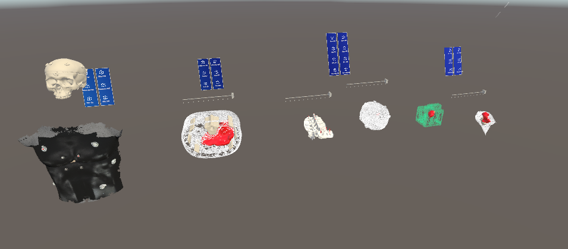

  <h1 align="center">Depth-based registration of 3D preoperative models to intraoperative patient anatomy using the HoloLens 2</h1>
  

    <a href="https://scholar.google.com/citations?hl=en&user=aGWjKpwAAAAJ"><strong>Enzo Kerkhof*</strong></a>
      ·
      <a href="https://scholar.google.com/citations?user=Y__2VicAAAAJ&hl=en&oi=ao"><strong>Abdullah Thabit*</strong></a>
      ·
      <a href="https://scholar.google.com/citations?user=f_xq1bEAAAAJ&hl=en"><strong>Mohamed Benmahdjoub</strong></a>
      ·
      <a href="https://scholar.google.com/citations?user=Ntchxt8AAAAJ&hl=en"><strong>Pierre Ambrosini</strong></a>
      ·
      <a href="https://pure.eur.nl/en/persons/tessa-van-ginhoven"><strong>Tessa van Ginhoven</strong></a>
      ·
      <a href="https://pure.eur.nl/en/persons/eppo-wolvius"><strong>Eppo B. Wolvius</strong></a>
      ·
      <a href="https://scholar.google.com/citations?user=pBz9JUEAAAAJ&hl=en"><strong>Theo van Walsum</strong></a>
  

(* Equal Contribution)

  <h3 align="center"><a href="https://doi.org/10.1007/s11548-025-03328-x">Paper</a> | <a href="https://www.youtube.com/watch?v=9MVZu2-7dJs">Video</a>
  

 

    

 

# Introduction

This repository contains the code framework used as implementation for the above [paper](https://doi.org/10.1007/s11548-025-03328-x).

This repository is a specialized fork of the [original HL2SS repository](https://github.com/jdibenes/hl2ss), specifically based on [commit d381921](https://github.com/jdibenes/hl2ss/commit/d381921d859285ac45bd94dc094e840a9e224ee2). While the original repository continues to be maintained and updated by [@jdibenes](https://github.com/jdibenes), **this fork includes additional depth-based registration features AND modifications to the underlying HL2SS plugin and Unity scripts** that are designed to work together for the specific registration task described in the paper.

For the latest general HoloLens 2 sensor streaming updates, please refer to the original repository. For the specialized registration features and the necessary plugin/Unity modifications described in our paper, **you must use this fork**.

## Key Differences from Original HL2SS

The primary modification in this fork, is the **addition of a communication channel to send model transform data (position, rotation, scale) from the Python client to the Unity application**. This allows the `online_registration.py` script to calculate the registration alignment and update the pose of the 3D model displayed in the HoloLens in real-time.

Specifically:

1. **HL2SS Plugin Modification:** The C++ code for the HL2SS plugin (`hl2ss/plugin/ipc.cpp`, `hl2ss/plugin/plugin.cpp`, etc.) was modified to handle new message types for sending and receiving transform data over a dedicated message queue (MQ) port.
2. **Unity Script Modification:** The `RemoteUnityScene.cs` script (within the `unity_app` project) was updated to listen for these incoming transform messages. It uses a dictionary to map a unique **Instance ID** (sent from Python) to the corresponding `GameObject` in the Unity scene. When a transform message is received, the script finds the `GameObject` with the matching ID and applies the received position, rotation, and scale.

**Why this matters:**

* The `online_registration.py` script relies on this specific communication channel to visualize the registration results.
* The standard HL2SS plugin from the original repository *does not* have this transform communication feature.
* You **must** use the Unity project provided in the `unity_app` folder (or ensure your own project uses the modified `RemoteUnityScene.cs` and the compiled plugin from *this* repository) for the online registration to function correctly.

**Using the Feature (Unity Setup):**

Within the Unity Editor (`unity_app` project, `Patient Demo Scene`):

  

<em>Figure 1: RemoteUnityScene script component in the Unity Inspector, showing GameObjects assigned to Model slots.</em>

 

  

<em>Figure 2: Example GameObjects in the Unity "Patient Demo Scene" that can be controlled via the RemoteUnityScene script.</em>

 

* The `RemoteUnityScene` script is attached to the `Main Camera`.
* This script has a public field (visible in the Inspector) likely called `Scene Objects` or similar, which is a list or dictionary.
* You need to **associate the correct Instance ID (integer number) with each 3D model `GameObject`** that you want the Python script to control.
  * Drag the `GameObject` (e.g., the 3D model of the Lego, spine, etc.) from the Hierarchy window onto the corresponding slot in the `Scene Objects` list in the Inspector.
  * Ensure the Instance ID assigned in Unity matches the ID used in the `online_registration.py` script (or `online_functions.py`) when sending the transform data for that specific model.
  * The `unity_app` project's `Patient Demo Scene` should already have some examples configured.

## Getting started

To start using this software start by:

1. Pull this repository.
2. Read the original README section below after the HoloLens 2 Sensor Streaming section. Do not perform any steps yet.
3. Follow the following sections of the original README:
4. *Preparation*
5. *Python client*: use the `requirements.txt` provided to create a conda env (Python version 3.9.16 works). If you get issues with the installation of probreg and mmcv/mmdet you can skip them for now and solve later if you need them.
6. Install the Unity hub and add the Unity project located in the `unity_app` folder.
7. Install the detected Unity editor version for it and open the project. Choose OpenXR for the MRTK Project Configurator if prompted.
8. Follow the *Unity plugin* section from step **4** onwards using the included Unity project. **Ensure you are building and deploying the plugin code from *this* repository, not the original HL2SS.**
9. Also follow the *Using the plugin with Spatial Input support* section.
10. Deploy the Unity app to your HoloLens.

The Unity project/app (`unity_app`) present in this repository can be used for:

* Online registration for multiple phantoms.
  * Run `.\viewer\online_registration.py` for the main online qualitative registration.
  * You can switch between models on startup of the Python script or by using the voice-commands found in `online_registration.py`.
  * You can switch between eye initialization or manual initialization by importing the other registration function at the top of the code.
  * Use the Unity app in the `unity_app` folder for this and deploy the *Patient Demo scene*.
  * A simpler example script `.\viewer\online_registration_example.py` is also provided.

**Before** using any of the clients:

1. Change the project path for the function `get_model_path` in `.\viewer\online_functions.py` to the folder with your source models (e.g., the `unity_app\Assets\` folder).
2. Download the calibration files of the HoloLens you are using by running the `rm_calibration_downloader.py` script located in the `.\tools` directory from the command line (e.g., `python .\tools\rm_calibration_downloader.py --path .\calibration`). Ensure the `calibration` folder exists or is created by the script.
3. If you want to use the eye initialization feature (`online_registration_eye.py`), ensure you have run the eye calibration procedure on the HoloLens first.

The other python files in the `.\viewer` folder are primarily helper scripts for the main registration functionality.

*(The original README content from HL2SS follows below for reference regarding setup and general usage)*

# HoloLens 2 Sensor Streaming

HoloLens 2 server software and Python client library for streaming sensor data via TCP. Created to stream HoloLens data to a Linux machine for research purposes but also works on Windows and OS X. The server is offered as a standalone application (appxbundle) or Unity plugin (dll).

**Supported interfaces**

* Research Mode Visible Light Cameras (640x480 @ 30 FPS, Grayscale, H264 or HEVC encoded)
  * Left Front
  * Left Left
  * Right Front
  * Right Right
* Research Mode Depth
  * AHAT (512x512 @ 45 FPS, 16-bit Depth + 16-bit AB as NV12 luma+chroma, H264 or HEVC encoded)
  * Long Throw (320x288 @ 5 FPS, 16-bit Depth + 16-bit AB, encoded as a single 32-bit PNG)
* Research Mode IMU
  * Accelerometer (m/s^2)
  * Gyroscope (deg/s)
  * Magnetometer
* Front Camera (1920x1080 @ 30 FPS, RGB, H264 or HEVC encoded)
* Microphone (2 channels @ 48000 Hz, PCM 16, AAC encoded)
* Spatial Input (30 Hz)
  * Head Tracking
  * Eye Tracking
  * Hand Tracking
* Spatial Mapping
* Scene Understanding
* Voice Input
  
**Additional features**

* Download calibration data for the Front Camera and Research Mode sensors (except RM IMU Magnetometer).
* Optional per-frame pose for the Front Camera and Research Mode sensors.
* Client can configure the bitrate of the H264, HEVC, and AAC encoded streams.
* Client can configure the resolution and framerate of the Front Camera. See [etc/pv_configurations.txt](https://github.com/jdibenes/hl2ss/blob/main/etc/pv_configurations.txt) for a list of supported configurations.
* Client can configure the focus, white balance, and exposure of the Front Camera. See [viewer/client_rc.py](https://github.com/jdibenes/hl2ss/blob/main/viewer/client_rc.py).
* Frame timestamps can be converted to [Windows FILETIME](https://learn.microsoft.com/en-us/windows/win32/api/minwinbase/ns-minwinbase-filetime) (UTC) for external synchronization. See [viewer/client_rc.py](https://github.com/jdibenes/hl2ss/blob/main/viewer/client_rc.py).

## Preparation

Before using the server software configure your HoloLens as follows:

1. Enable developer mode: Settings -> Update & Security -> For developers -> Use developer features.
2. Enable device portal: Settings -> Update & Security -> For developers -> Device Portal.
3. Enable research mode: Refer to the Enabling Research Mode section in [HoloLens Research Mode](https://docs.microsoft.com/en-us/windows/mixed-reality/develop/advanced-concepts/research-mode).

Please note that **enabling Research Mode on the HoloLens increases battery usage**.

## Installation

## Permissions

The first time the server runs it will ask for the necessary permissions to access sensor data. If there are any issues please verify that the server application (hl2ss.exe) has access to:

* Camera (Settings -> Privacy -> Camera).
* Eye tracker (Settings -> Privacy -> Eye tracker).
* Microphone (Settings -> Privacy -> Microphone).
* User movements (Settings -> Privacy -> User movements).

## Python client

The Python scripts in the [viewer](https://github.com/jdibenes/hl2ss/tree/main/viewer) directory demonstrate how to connect to the server, receive the data, unpack it, and decode it in real time. Additional samples show how to associate data from multiple streams. Run the server on your HoloLens and set the host variable of the Python scripts to your HoloLens IP address.

**Registration scripts**

* online_registration: [viewer/online_registration.py]()
* online_registration_example: [viewer/online_registration_example.py]()

**Required packages**

* [OpenCV](https://github.com/opencv/opencv-python) `pip install opencv-python`
* [PyAV](https://github.com/PyAV-Org/PyAV) `pip install av`
* [NumPy](https://numpy.org/) `pip install numpy`
* [Websockets](https://github.com/aaugustin/websockets) `pip install websockets`
* [Open3D](http://www.open3d.org/) `pip install open3d` (Required for registration scripts)
* [pynput](https://github.com/moses-palmer/pynput) `pip install pynput` (Required for keyboard control in examples)

**Optional packages**

* [PyAudio](https://people.csail.mit.edu/hubert/pyaudio/) `pip install PyAudio`
* [MMDetection](https://github.com/open-mmlab/mmdetection) (Not required for core registration functionality)

## Unity plugin

For streaming sensor data from a Unity application.
All streams are supported.
However, to enable Spatial Input stream support the plugin must be initialized from the UI thread.
This process is described later in this section.
The `unity_app` folder contains a pre-configured Unity project using this plugin.

**Using the plugin without Spatial Input support**

1. Download the [latest plugin zip file](https://github.com/jdibenes/hl2ss/releases) and extract the Assets folder into your Unity project.
    * If you wish to create a new Unity project to test the plugin, first follow the intructions [here](https://learn.microsoft.com/en-us/training/modules/learn-mrtk-tutorials/1-1-introduction) and then continue with the instructions presented in this section.
2. In the Unity Editor, configure the hl2ss and Scene Understanding DLLs as UWP ARM64.
    1. In the Project window navigate to Assets/Plugins/WSA, select the DLL, then go to the Inspector window.
    2. Set SDK to UWP.
    3. Set CPU to ARM64.
    4. Click Apply.
3. Add the Hololens2SensorStreaming.cs script to the Main Camera.
4. Build the project for UWP (File -> Build Settings).
    1. Add your Unity scenes to Scenes in Build.
    2. Set Platform to Universal Windows Platform.
    3. Click Switch Platform.
    4. Set Target Device to HoloLens.
    5. Set Architecture to ARM64.
    6. Set Build Type to D3D Project.
    7. Set Target SDK Version to Latest installed.
    8. Set Visual Studio Version to Latest installed.
    9. Set Build and Run on Local Machine.
    10. Set Build configuration to Release.
    11. Click Build. Unity will ask for a destination folder. You can create a new one named Build.
5. Navigate to the Build folder and open the Visual Studio solution in Visual Studio 2022.
6. Open Package.appxmanifest and enable the following capabilities:
    * Gaze Input
    * Internet (Client & Server)
    * Internet (Client)
    * Microphone
    * Private Networks (Client & Server)
    * Spatial Perception
    * Webcam
7. Right click Package.appxmanifest, select Open With, and select HTML Editor. Edit Package.appxmanifest as follows:
    1. In Package add `xmlns:rescap="http://schemas.microsoft.com/appx/manifest/foundation/windows10/restrictedcapabilities"`.
    2. Under Capabilities add `<rescap:Capability Name="perceptionSensorsExperimental"/>`.
    3. Under Capabilities add `<DeviceCapability Name="backgroundSpatialPerception"/>`.
    * See the [Package.appxmanifest](https://github.com/jdibenes/hl2ss/blob/main/hl2ss/hl2ss/Package.appxmanifest) of the server for an example. Note that the order in which Capabilites are declared matters.
8. Set build configuration to Release ARM64.
9. Right click the project in bold and select Properties. Navigate to Configuration Properties -> Debugging and set Machine Name to your HoloLens IP address.
10. Run. The application will remain installed on the HoloLens even after power off.

**Using the plugin with Spatial Input support**

1. Follow steps 1 through 3 of the previous section.
2. For the Hololens2SensorStreaming script component of the Main Camera, enable Skip Initialization.
3. Follow steps 4 through 9 of the previous section.
4. Right click the project in bold and select Properties.
5. Nagivate to Configuration Properties -> C/C++ -> General -> Additional Include Directories and add the include folder of the plugin. = `..\..\additional_lib_include\include`
6. Nagivate to Configuration Properties -> Linker -> General -> Additional Library Directories and add the lib folder of the plugin. = `..\..\additional_lib_include\lib`
7. Navigate to Configuration Properties -> Linker -> Input -> Additional Dependencies and add hl2ss.lib.
8. Open App.cpp and edit it as follows:
    1. `#include <hl2ss.h>` after the other includes.
    2. At the end of the `App::SetWindow(CoreWindow^ window)` method, right before the closing `}`, add `InitializeStreams(HL2SS_ENABLE_RM | HL2SS_ENABLE_PV | HL2SS_ENABLE_MC | HL2SS_ENABLE_SI | HL2SS_ENABLE_RC | HL2SS_ENABLE_SM | HL2SS_ENABLE_SU | HL2SS_ENABLE_VI | HL2SS_ENABLE_MQ);`.
9. Follow step 10 of the previous section.

**Remote Unity Scene**

The plugin has basic support for creating and controlling 3D primitives and text objects via TCP for the purpose of sending feedback to the HoloLens user. See the unity_demo Python scripts in the [viewer](https://github.com/jdibenes/hl2ss/tree/main/viewer) directory for some examples. Some of the supported features include:

* Create primitive: sphere, capsule, cylinder, cube, plane, and quad.
  * In this branch: this function returns the GameObject Unity Instance ID of the, in the editor, coupled object.
* Set active: enable or disable game object.
* Set world transform: position, rotation, and scale. **(This fork changes this feature via a dedicated MQ channel as described in the 'Key Differences' section above)**
* Set color: rgba with support for semi-transparency.
* Set texture: upload png or jpg file.
* Create text: creates a TextMeshPro object.
* Set text: sets the text, font size and color of a TextMeshPro object.
* Remove: destroy game object.
  * In this branch: this function removes the GameObject Unity Instance ID from the private remote unity scene C# dict.
* Remove all: destroy all game objects created by the plugin.

To enable this functionality, add the [RemoteUnityScene.cs](https://github.com/jdibenes/hl2ss/blob/main/unity/RemoteUnityScene.cs) script (using the version from *this* repository located in `unity_app/Assets/Scripts/`) to the Main Camera and set the Material field to [BasicMaterial](https://github.com/jdibenes/hl2ss/blob/main/unity/BasicMaterial.mat). **Configure the GameObject Instance ID mapping as described in the 'Key Differences' section.**

## Build from source and deploy

Building the server application and the Unity plugin requires a Windows 10 machine. If you have previously installed the server application using the appxbundle it is recommended that you uninstall it first.

1. [Install the tools](https://docs.microsoft.com/en-us/windows/mixed-reality/develop/install-the-tools).
2. Open the Visual Studio solution (sln file in the [hl2ss](https://github.com/jdibenes/hl2ss/tree/main/hl2ss) folder) in Visual Studio 2022.
3. Set build configuration to Release ARM64. Building for x86 and x64 (HoloLens emulator), and ARM is not supported.
4. Right click the hl2ss project and select Properties. Navigate to Configuration Properties -> Debugging and set Machine Name to your HoloLens IP address.
5. Build (Build -> Build Solution). If you get an error saying that hl2ss.winmd does not exist, copy the hl2ss.winmd file from [etc](https://github.com/jdibenes/hl2ss/tree/main/etc) into the hl2ss\ARM64\Release\hl2ss folder.
6. Run (Remote Machine). You may need to [pair your HoloLens](https://learn.microsoft.com/en-us/windows/mixed-reality/develop/advanced-concepts/using-visual-studio?tabs=hl2#pairing-your-device) first.

The server application will remain installed on the HoloLens even after power off. The Unity plugin is in the hl2ss\ARM64\Release\plugin folder.
If you wish to create the server application appxbundle, right click the hl2ss project and select Publish -> Create App Packages.

## Known issues and limitations

* Multiple streams can be active at the same time but only one client per stream is allowed.
* Ocassionally, the server might crash when accessing the Front Camera and RM Depth Long Throw streams simultaneously. See <https://github.com/microsoft/HoloLens2ForCV/issues/142>.
* Currently, it is not possible to access the Front Camera and RM Depth AHAT streams simultaneously without downgrading the HoloLens OS. See <https://github.com/microsoft/HoloLens2ForCV/issues/133>.
* The RM Depth AHAT and RM Depth Long Throw streams cannot be accessed simultaneously.

## References

This project uses the HoloLens 2 Research Mode API and the Cannon library, both available at the [HoloLens2ForCV](https://github.com/microsoft/HoloLens2ForCV) repository.

## Room for contribution

* Get this branch merged with hl2ss main without breaking things (***a lot of work***):
  * This means checking all helper functions and changes in main from the last month of HL2ss
  * Make the registration scripts work again
  * Make sure the adjustments in the C++ and C# stay for the Unity transformation scene communication
  * Make sure all streams still initialize (double check spatial input since @jdibenes added extended eye tracking + more).
